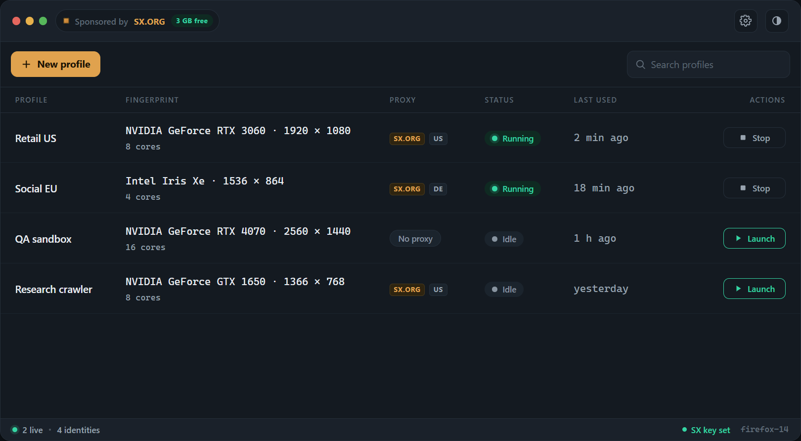

<p>
  <a href="LICENSE"></a>
  <a href="https://www.python.org/downloads/"></a>
  <a href="https://github.com/feder-cr/firefox_antidetect/stargazers"></a>
</p>

<h3 align="center">Run many undetectable browser profiles on one patched Firefox.</h3>

One desktop app, many identities. Each profile is a distinct fingerprint (GPU, canvas, fonts, audio, WebRTC) set at the C++ source level plus its own proxy and saved logins, so every profile passes bot detection on its own. Hit Launch and a real Firefox window opens with that identity.

<div align="center">

</div>

## Install

```bash
pip install git+https://github.com/feder-cr/firefox_antidetect.git
python -m firefox_antidetect
```

Everything it needs is downloaded automatically, nothing to fetch by hand: the patched Firefox binary (once, SHA256-verified, cached) the moment the app opens, and the GeoIP database when a proxy needs it. Runs on **Windows**, **Linux** and **macOS**.

Built on [invisible_core](https://github.com/feder-cr/invisible_core); it launches the binary directly, no Playwright.

## What you get

- **One identity per profile** - GPU, screen, fonts and ~400 other fields from a seed, stable across launches.
- **Persistent** - each profile keeps its own cookies, storage and logins in its own directory.
- **Per-profile proxy** - none, or [sx.org](https://sx.org/?c=invisible_playwright) residential, with country and city per profile.
- **Live status** - see which profiles are running; close the browser and the list updates itself.

## Proxies

Around 90% of proxies are public, so their IPs are already known and blocked. For the clean 10%, residential IPs that aren't already known, we recommend [sx.org](https://sx.org/?c=invisible_playwright): set your API key once in the Proxies menu, then pick a country and city per profile. New accounts get 3 GB free with code `STEALTH`.

## Related projects

- **[invisible_core](https://github.com/feder-cr/invisible_core)** - the pure-config engine (seed to fingerprint to prefs, binary download, proxy, geo) this app runs on.
- **[invisible_playwright](https://github.com/feder-cr/invisible_playwright)** - the same patched Firefox driven by Playwright, for automation.
- **[firefox_antidetect_patch](https://github.com/feder-cr/firefox_antidetect_patch)** - the C++ patches against Firefox that produce the binary.

## License

MIT - see [LICENSE](LICENSE). The patched Firefox binary is distributed under the MPL-2.0 (Firefox upstream license).

## Disclaimer

This project is for educational purposes only. It is provided as-is, with no warranties. I take no responsibility for how it is used. Use it at your own risk and in compliance with the laws of your jurisdiction.

---

<p align="center">
  Built by <a href="https://it.linkedin.com/in/federico-elia-5199951b6">Federico Elia</a>
  &nbsp;<a href="https://it.linkedin.com/in/federico-elia-5199951b6"></a>
</p>
